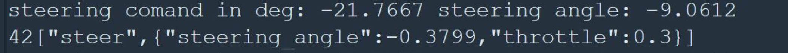
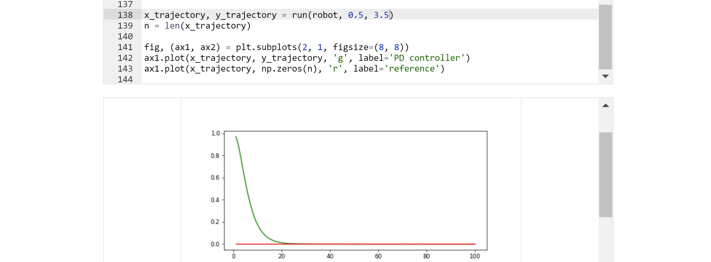

# PID-Controller
Proportional Integral Derivative algorithm to smoothly control a car's direction and velocity through steering angle and throttle actuators.


Let's say you are driving on the right hand side of your lane and you want to get centered in the middle. How do you steer? Do you just steer left until you got to the middle and than you stop steering? 

Do the test! You'll become aware that you have a PID controller embedded in your instincts. At the beginning you steer harder to the left to get your car going towards the middle of the lane. Before you get there you steer right to align the car to the road again. In conclusion, you steer both left and right for this maneuver. 

[PID](https://en.wikipedia.org/wiki/PID_controller) is one of the most popular control algorithms, it's a hundred years old and it is still used because it gets the job done.

In this project I implemented two PID controllers to drive the car around the lake track.
The project is implemented in C++ the source code can be found in the *src* folder above. The PID class is implemented under PID.h and PID.cpp. The steering angle and throttle values are calculated under h.onMessage function in main.cpp
The sterter code for this project is provided by Udacity and can be found [here](https://github.com/udacity/CarND-PID-Control-Project).

## What Is PID?

PID is a closed loop feedback controller that produces a control value based on the error between the current state of the system and the desired state.

 

In the equation above e(t) is the error. Let's say the car's desired position is in the middle of the lane and the car's current position is 2m to the right. The error in this case is 2m. 

Kp is the proportional gain. Using Kp the car will steer left while moving forward down the road. The steering value will be large at the begining as the error is large. As the car approaches the desired centered position, the steering angle approaches zero. When the car is in the middle of the road the steering angle is zero, but the car will keep going left since it is still slightly facing that way.
The Kp component of the controller helps steer the car in the correct direction, but using only Kp in an inertial system as a car, leads to haveing an overshoot. In this manner, the car will drive in a S shape along the desired trajectory.

Kd is the derivative gain. It is used together with Kp to compensate for the overshoot. de(t)/dt is the derivate of the error. As the error gets smaller in time, the derivative is negative. The faster the car is approaching the center of the road, the stronger the derivative effect. When the error gets smaller, Kd will overpower Kp effect and the car will start steering in the opposite direction to get alligned with the road. 

Ki is the integral gain. In a discrete system as an embedded ECU, this is calculated as the sum of the error over time. The integral is used if a control value is needed to keep the system in the desired state i.e. when the error is zero. For a well calibrated direction system in a car, the integral component is not needed when controlling the car's trajectory through the steering angle, as on a straight line the car should be able to drive holding its steering angle at zero. 
For controlling the velocity on the other hand, the integral is needed because we still need the throttle value to keep going at 30MPH for example, even if the car's speed is already 30MPH. 

## PID Implementation
The PID controller is implemented using the PID class. 
Total error is used to calculate the control value in a similar way as the equation from above.

```
double PID::TotalError() {
  /**
   * TODO: Calculate and return the total error
   */
  double total_error;
  total_error = Kp * p_error + Kd * d_error + Ki * i_error;
  //std::cout<<"The composition of steering angle is: "<<std::endl;
  //std::cout<<"Kp "<< Kp <<" * p_error "<<p_error<<" + Kd "<< Kd <<" * d_error " << d_error <<"= "<<total_error<<std::endl;
  return total_error;  // TODO: Add your total error calc here!
}
```
Printing out the decomposition of the control value is useful for debuging when choosing the right Kp, Kd and Ki values.

The p_error, i_error and d_error are calculated below. The p_error is the straight value taken from the feedback loop. It represent the diference between the desired system state and its current state.
d_error or the derivate, is simply the substractio between the previous error and the current one. i_error or the integral, is the sum of errors over time.

```
void PID::UpdateError(double cte) {
  /**
   * TODO: Update PID errors based on cte.
   */
  i_error += cte;
  d_error = cte - p_error; //it can be initialized with CTE value because the simulator is responsive only after 2 cycles
  p_error = cte;
}
```


## Controlling The Direction
The first controller of this project is the one that through the steering angle, makes the car drive along the road as close as possible to its center.

At the beginning I set the steering angle to a hardcoded value of zero and launched the simulator to see if the car goes straignt. I noticed that the steering angle was correctly set to zero, no deviation and the car seemed (visually) to be driving straingt. This is how I decided that for the direction control, the integral component is not needed.

For the Kp and Kd values, one needs to know the dynamics of the process to be able to calculate them. The car is approximated to a bycicle and the equations are already given in the Udacity class.

```
        # Execute motion
        turn = np.tan(steering) * distance / self.length

        if abs(turn) < tolerance:
            # approximate by straight line motion
            self.x += distance * np.cos(self.orientation)
            self.y += distance * np.sin(self.orientation)
            self.orientation = (self.orientation + turn) % (2.0 * np.pi)
        else:
            # approximate bicycle model for motion
            radius = distance / turn
            cx = self.x - (np.sin(self.orientation) * radius)
            cy = self.y + (np.cos(self.orientation) * radius)
            self.orientation = (self.orientation + turn) % (2.0 * np.pi)
            self.x = cx + (np.sin(self.orientation) * radius)
            self.y = cy - (np.cos(self.orientation) * radius)
```

I changed the vehicle's length to 4 meters and used the motion model in the class to tune the Kp and Kd paramaters.

 

Kp = 0.5 and Kd = 2.5 seem to provide a good vehicle trajectory in following a reference line.


I plugged these values into the implementation and started the simulator. The vehicle was very unstable, the oscilations were strong and the car was not even able to drive on a straight line.

This behavior was very surprising since the results looked good on the graph. Then, I realized that the car was steering with an angle in between -25deg and +25deg when the control values were given between -1rad and 1rad corresponding to -57deg and +57deg.

Then I monitored the control values and the actuator values in debug to see what is happening.



And here is the problem. The car does not steer with the controller provided value and it has a 2/3 reducing factor.

I integrated this factor in the vehicle's dymanic model and confirmed that this is the source of the unexpected oscilations.


With this updated vehicle model, I chose to increase the Kd value to compensate the overshooting.
I chose Kp = 0.5 as before and increased Kd = 3.5



Got the simulator running and this time the car is able to follow a straight line trajectory. This is a great result!
The remaining problem is that it becomes very unstable in curves. I took a look of how the control value is calculated and realized that such a big Kd induces the instability. When driving into a curve, the error grows very fast making the Kd component built a lot on top of Kp and results in oversteering.

I then used the vehicle model to find a Kp Kd combination that doesn't overshoot but allows for Kd to be smaller.

I chose Kp = 0.04 and lowered Kd = 1


In the simulator the vehicle is still able to drive on a straight line, but it is too slow to turn on curves and gets the car off the track.

I kept tuning the parameters from this point by trial and error. Got a pair Kp = 0.1 and Kd = 1.2 that seems like a good compromise. These are my final tuned values.

## Controlling The Velocity


## Simulation Video